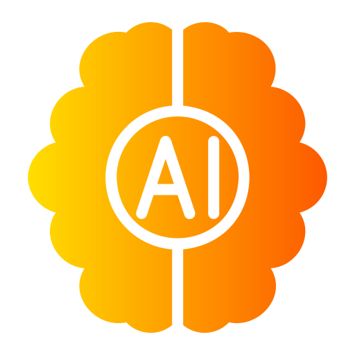

<!DOCTYPE html>
<html lang="en">

<head>
  <meta charset="UTF-8">
  <meta http-equiv="X-UA-Compatible" content="IE=edge">
  <meta name="viewport" content="width=device-width, initial-scale=1.0">
  <title>Muneeb Tariq - Personal Portfolio</title>

  <!--
    - favicon
  -->
  
  <!--
    - custom css link
  -->
  <link rel="stylesheet" href="./assets/css/style.css">

  <!--
    - google font link
  -->
  <link rel="preconnect" href="https://fonts.googleapis.com">
  <link rel="preconnect" href="https://fonts.gstatic.com" crossorigin>
  <link href="https://fonts.googleapis.com/css2?family=Poppins:wght@300;400;500;600&display=swap" rel="stylesheet">
</head>

<body>

  <!--
    - #MAIN
  -->

  <main>

    <!--
      - #SIDEBAR
    -->

    <aside class="sidebar" data-sidebar>

      

        <figure class="avatar-box">
          
        </figure>

        

          <h1 class="name" title="Muneeb Tariq">Muneeb Tariq</h1>

          
  AI Engineer   Django Developer 

        

        <button class="info_more-btn" data-sidebar-btn>
          Show Contacts

          <ion-icon name="chevron-down"></ion-icon>
        </button>

      

      

        

        <ul class="contacts-list">

          <li class="contact-item">

            

              <ion-icon name="mail-outline"></ion-icon>
            

            

              
Email

              <a href="mailto:muhammadmuneebtariq07@gmail.com" class="contact-link">muhammadmuneeb tariq07@gmail.com</a>
            

          </li>

          <li class="contact-item">

            

              <ion-icon name="phone-portrait-outline"></ion-icon>
            

            

              
Phone

              <a href="tel:+92 336 9939547" class="contact-link">+92 336 9939547</a>
            

          </li>

          <li class="contact-item">

            

              <ion-icon name="calendar-outline"></ion-icon>
            

            

              
Birthday

              <time datetime="2001-08-16">August 16, 2001</time>
            

          </li>

          <li class="contact-item">

            

              <ion-icon name="location-outline"></ion-icon>
            

            

              
Location

              <address>Islamabad, Pakistan</address>
            

          </li>

        </ul>

        

        <ul class="social-list">

          

        

          <li class="social-item">
            <a href="https://www.linkedin.com/in/muhammad-muneeb-39172119a" class="social-link">
              <ion-icon name="logo-linkedin"></ion-icon>
            </a>
          </li>

          <li class="social-item">
            <a href="https://github.com/Sardarmani" class="social-link">
              <ion-icon name="logo-github"></ion-icon>
            </a>
          </li>

        </ul>

      

    </aside>

    <!--
      - #main-content
    -->

    

      <!--
        - #NAVBAR
      -->

      <nav class="navbar">

        <ul class="navbar-list">

          <li class="navbar-item">
            <button class="navbar-link  active" data-nav-link>About</button>
          </li>

          <li class="navbar-item">
            <button class="navbar-link" data-nav-link>Resume</button>
          </li>

          <li class="navbar-item">
            <button class="navbar-link" data-nav-link>Portfolio</button>
          </li>

          <li class="navbar-item">
            <button class="navbar-link" data-nav-link>Blog</button>
          </li>

          <li class="navbar-item">
            <button class="navbar-link" data-nav-link>Contact</button>
          </li>

        </ul>

      </nav>

      <!--
        - #ABOUT
      -->

      <article class="about  active" data-page="about">

        <header>
          <h2 class="h2 article-title">About me</h2>
        </header>

        <section class="about-text">
          

            
Hi, I'm Muneeb Tariq, a passionate and dedicated computer science student based in Islamabad, Pakistan. I have a strong foundation in software development and data analysis, with a keen interest in artificial intelligence and machine learning.

            
Currently, I am pursuing a Bachelor's degree in Computer Science from Quaid-e-Azam University, where I have been exposed to a wide range of coursework including data structures, artificial intelligence, web development, and compiler construction. I maintain a GPA of 3.2 and actively engage in projects and Internships to enhance my skills.

            
In addition to my academic pursuits, I have gained practical experience through internships and projects. As a Data Analyst at Wenclims, I have developed data-driven insights from complex datasets. I have also worked as a Software Developer (Internee) at Software Productivity Strategists inc (SPS), where I enhanced my programming skills and resolved critical software issues.

            
Currently, I am furthering my knowledge and skills as an AI Trainee Intern at ExpertFlow, where I am excited to explore new challenges and contribute to innovative projects.

        

        
        </section>

        <!--
          - service
        -->

        <section class="service">

          <h3 class="h3 service-title">What i'm doing</h3>

          <ul class="service-list">

            <li class="service-item">

              

                
              

              

                <h4 class="h4 service-item-title">Artifical ntelligence </h4>

                

                  I am passionate about artificial intelligence technologies, including natural language processing, computer vision, and neural networks.                

              

            </li>

            <li class="service-item">

              

                
              

              

                <h4 class="h4 service-item-title">Machine Learning</h4>

                

                  I specialize in machine learning techniques for predictive modeling, data analysis, and pattern recognition.                

              

            </li>

            <li class="service-item">

              

                
              

              

                <h4 class="h4 service-item-title">Web development</h4>

                

                  High-quality development of sites at the professional level.
                

              

            </li>

            <li class="service-item">

              

                
              

              

                <h4 class="h4 service-item-title">Mobile apps</h4>

                

                  Professional development of applications for iOS and Android.
                

              

            </li>

            
          </ul>

        </section>

        <!--
          - testimonials
        -->

  

        <!--
          - testimonials modal
        -->

        

          

          <section class="testimonials-modal">

            <button class="modal-close-btn" data-modal-close-btn>
              <ion-icon name="close-outline"></ion-icon>
            </button>

            

              <figure class="modal-avatar-box">
                
              </figure>

              
            

            

              <h4 class="h3 modal-title" data-modal-title>Daniel lewis</h4>

              <time datetime="2021-06-14">14 June, 2021</time>

              
            

          </section>

        

        <!--
          - clients
        -->

   
      </article>

      <!--
        - #RESUME
      -->

      <article class="resume" data-page="resume">

        <header>
          <h2 class="h2 article-title">Resume</h2>
        </header>

        <section class="timeline">

          

            

              <ion-icon name="book-outline"></ion-icon>
            

            <h3 class="h3">Education</h3>
          

          <ol class="timeline-list">

            <li class="timeline-item">
        
                <h4 class="h4 timeline-item-title">Quaid-i-Azam University</h4>
        
                2020 — 2024
        
                

                    Completed Bachelor of Science in Computer Science (BSCS). Key courses included:
                    <ul style="color: aliceblue;">
                        <li>Data Structures and Algorithms</li>
                        <li>Operating Systems</li>
                        <li>Database Systems</li>
                        <li>Artificial Intelligence</li>
                        <li>Software Engineering</li>
                        <li>Machine Learning</li>
                    </ul>
                

        
            </li>
        
            <li class="timeline-item">
        
                <h4 class="h4 timeline-item-title">Lawrence College Ghora Gali, Murree</h4>
        
                2017 — 2019
                
                

                    Completed F.Sc. (Pre-Engineering). Key courses included:
                    <ul style="color: aliceblue;">
                        <li>Mathematics</li>
                        <li>Physics</li>
                        <li>Chemistry</li>
                        <li>English</li>
                    </ul>
                

        
            </li>
        
            <li class="timeline-item">
        
                <h4 class="h4 timeline-item-title">Matriculation</h4>
        
                2015 — 2017
        
                

                    Completed high school with a focus on Science. Key subjects included:
                    <ul style="color: aliceblue;">
                        <li>Biology</li>
                        <li>Chemistry</li>
                        <li>Mathematics</li>
                        <li>Physics</li>
                    </ul>
                

        
            </li>
        
        </ol>
        
        </section>

        <section class="timeline">

          

            

              <ion-icon name="book-outline"></ion-icon>
            

            <h3 class="h3">Experience</h3>
          

          <ol class="timeline-list">

            <li class="timeline-item">

              <h4 class="h4 timeline-item-title">AI Engineer</h4>

              04-2024 — Present

              

                Nemo enim ipsam voluptatem blanditiis praesentium voluptum delenit atque corrupti, quos dolores et qvuas
                molestias
                exceptur.
              

            </li>

            <li class="timeline-item">

              <h4 class="h4 timeline-item-title">Data Analyst</h4>

              06-2023 — Present

              

                Nemo enims ipsam voluptatem, blanditiis praesentium voluptum delenit atque corrupti, quos dolores et
                quas molestias
                exceptur.
              

            </li>

            <li class="timeline-item">

              <h4 class="h4 timeline-item-title">Software Developer (Internee)</h4>

              05-2023 – 7-2023

              

                Nemo enims ipsam voluptatem, blanditiis praesentium voluptum delenit atque corrupti, quos dolores et
                quas molestias
                exceptur.
              

            </li>

          </ol>

        </section>

        <section class="skill">

          <h3 class="h3 skills-title">My skills</h3>

          <ul class="skills-list content-card">

            <li class="skills-item">

              

                <h5 class="h5">Problem Solbing</h5>
                <data value="80">80%</data>
              

              

                

              

            </li>

            <li class="skills-item">

              

                <h5 class="h5">Machine Learning</h5>
                <data value="80">80%</data>
              

              

                

              

            </li>

            <li class="skills-item">

              

                <h5 class="h5">Django Development</h5>
                <data value="70">70%</data>
              

              

                

              

            </li>

            <li class="skills-item">

              

                <h5 class="h5">Python Programming</h5>
                <data value="90">90%</data>
              

              

                

              

            </li>

            <li class="skills-item">

              

                <h5 class="h5">Data Analysis</h5>
                <data value="75">75%</data>
              

            
              

                

              

            
            </li>

          </ul>

        </section>

      </article>

      <!--
        - #PORTFOLIO
      -->

      <article class="portfolio" data-page="portfolio">

        <header>
          <h2 class="h2 article-title">Portfolio</h2>
        </header>

        <section class="projects">

          

            <button class="filter-select" data-select>

              
Select category

              

                <ion-icon name="chevron-down"></ion-icon>
              

            </button>

            <ul class="select-list">

              <li class="select-item">
                <button data-select-item>All</button>
              </li>

              <li class="select-item">
                <button data-select-item>Web design</button>
              </li>

              <li class="select-item">
                <button data-select-item>Applications</button>
              </li>

              <li class="select-item">
                <button data-select-item>Web development</button>
              </li>

            </ul>

          

          <ul class="project-list">

            <li class="project-item  active" data-filter-item data-category="web development">
              <a href="https://github.com/Sardarmani/Protein-Function-Prediction">

                <figure class="project-img">
                  

                    <ion-icon name="eye-outline"></ion-icon>
                  

                  
                </figure>

                <h3 class="project-title">Protein-Function-Prediction</h3>

                
Machine Learning

              </a>
            </li>

            <li class="project-item  active" data-filter-item data-category="machine-learning">
              <a href="https://github.com/Sardarmani/stock_exchange_predictor">

                <figure class="project-img">
                  

                    <ion-icon name="eye-outline"></ion-icon>
                  

                  
                </figure>

                <h3 class="project-title">Stock Exchange Predictor</h3>

                
Machine Learning

              </a>
            </li>

            <li class="project-item  active" data-filter-item data-category="web development">
              <a href="#">

                <figure class="project-img">
                  

                    <ion-icon name="eye-outline"></ion-icon>
                  

                  
                </figure>

                <h3 class="project-title">E-Commerce Website</h3>

                
Web development 

              </a>
            </li>

            <li class="project-item  active" data-filter-item data-category="applications">
              <a href="https://github.com/Sardarmani/parkinson-s-disease-Classification">

                <figure class="project-img">
                  

                    <ion-icon name="eye-outline"></ion-icon>
                  

                  
                </figure>

                <h3 class="project-title">Parkinson's disease classification</h3>

                
Machine Learning

              </a>
            </li>

            <li class="project-item  active" data-filter-item data-category="web design">
              <a href="https://github.com/Sardarmani/Audio-Classificaion-Using-Deep-Learning">

                <figure class="project-img">
                  

                    <ion-icon name="eye-outline"></ion-icon>
                  

                  
                </figure>

                <h3 class="project-title">Audio-Classificaion-Using-Deep-Learning </h3>

                
Machine Learning

              </a>
            </li>

            <li class="project-item  active" data-filter-item data-category="web development">
              <a href="https://github.com/Sardarmani/department">

                <figure class="project-img">
                  

                    <ion-icon name="eye-outline"></ion-icon>
                  

                  
                </figure>

                <h3 class="project-title">Departmental Website</h3>

                
Web development

              </a>
            </li>

            <li class="project-item  active" data-filter-item data-category="applications">
              <a href="https://github.com/Sardarmani/Library-Managment-System">

                <figure class="project-img">
                  

                    <ion-icon name="eye-outline"></ion-icon>
                  

                  
                </figure>

                <h3 class="project-title">Library Managment System</h3>

                
Console based Applications

              </a>
            </li>

            
              <a href="#">

                <figure class="project-img">
                  

                    <ion-icon name="eye-outline"></ion-icon>
                  

                  
                </figure>

                <h3 class="project-title">Movie Rating Classification Using KNN (K- Nearest Neighbors)</h3>

                
Machine Learning

              </a>
            </li>

          </ul>

        </section>

      </article>

      <!--
        - #BLOG
      -->

      <article class="blog" data-page="blog">

        <header>
          <h2 class="h2 article-title">Blog</h2>
        </header>
      
        <section class="blog-posts">
      
          <ul class="blog-posts-list">
      
            <li class="blog-post-item">
              <blockquote class="wp-embedded-content" data-secret="YxcD878wqp"><a href="https://muneebtariqcom.wordpress.com/2024/02/12/protein-prediction/">Title: Unveiling Protein Secrets: Revolutionizing Bioinformatics with Machine&nbsp;Learning</a></blockquote>
              <iframe sandbox="allow-scripts" security="restricted" src="https://muneebtariqcom.wordpress.com/2024/02/12/protein-prediction/embed/#?secret=YxcD878wqp" width="100%" height="100%" title="&#8220;Title: Unveiling Protein Secrets: Revolutionizing Bioinformatics with Machine&nbsp;Learning&#8221; &#8212; Mani&#039;s Blogs" data-secret="YxcD878wqp" frameborder="0" marginwidth="0" marginheight="0" scrolling="no" class="wp-embedded-content"></iframe>
            </li>
      

            <li class="blog-post-item">
              <blockquote class="wp-embedded-content" data-secret="EYnVOZy8gz"><a href="https://muneebtariqcom.wordpress.com/2024/01/10/forecasting-stock-prices-of-abbott-laboratoriespsx-company-using-prophet/">Forecasting Stock Prices of Abbott Laboratories(PSX Company) Using&nbsp;Prophet</a></blockquote>
              <iframe sandbox="allow-scripts" security="restricted" src="https://muneebtariqcom.wordpress.com/2024/01/10/forecasting-stock-prices-of-abbott-laboratoriespsx-company-using-prophet/embed/#?secret=EYnVOZy8gz" width="100%" height="100%" title="&#8220;Forecasting Stock Prices of Abbott Laboratories(PSX Company) Using&nbsp;Prophet&#8221; &#8212; Mani&#039;s Blogs" data-secret="EYnVOZy8gz" frameborder="0" marginwidth="0" marginheight="0" scrolling="no" class="wp-embedded-content"></iframe>
                
                 </li>
      

                 <li class="blog-post-item">
                  <blockquote class="wp-embedded-content" data-secret="wNStapnujP"><a href="https://muneebtariqcom.wordpress.com/2023/09/10/detrend/">Demystifying Detrending: Uncovering Insights in Time Series&nbsp;Data</a></blockquote><iframe sandbox="allow-scripts" security="restricted" src="https://muneebtariqcom.wordpress.com/2023/09/10/detrend/embed/#?secret=wNStapnujP" width="100%" height="100%" title="&#8220;Demystifying Detrending: Uncovering Insights in Time Series&nbsp;Data&#8221; &#8212; Mani&#039;s Blogs" data-secret="wNStapnujP" frameborder="0" marginwidth="0" marginheight="0" scrolling="no" class="wp-embedded-content"></iframe>
                      
                     </li>

                     <li class="blog-post-item">
                      <blockquote class="wp-embedded-content" data-secret="shkrmzPBQW"><a href="https://muneebtariqcom.wordpress.com/2023/03/13/ssh-command/">SSH Command</a></blockquote><iframe sandbox="allow-scripts" security="restricted" src="https://muneebtariqcom.wordpress.com/2023/03/13/ssh-command/embed/#?secret=shkrmzPBQW" width="100%" height="100%" title="&#8220;SSH Command&#8221; &#8212; Mani&#039;s Blogs" data-secret="shkrmzPBQW" frameborder="0" marginwidth="0" marginheight="0" scrolling="no" class="wp-embedded-content"></iframe>
                            
                         </li>

                         <li class="blog-post-item">
                          <blockquote class="wp-embedded-content" data-secret="ssP10FnJHA"><a href="https://muneebtariqcom.wordpress.com/2023/08/13/unveiling-the-power-of-web-scraping-your-gateway-to-data-exploration/">Unveiling the Power of Web Scraping: Your Gateway to Data&nbsp;Exploration</a></blockquote><iframe sandbox="allow-scripts" security="restricted" src="https://muneebtariqcom.wordpress.com/2023/08/13/unveiling-the-power-of-web-scraping-your-gateway-to-data-exploration/embed/#?secret=ssP10FnJHA" width="100%" height="100%" title="&#8220;Unveiling the Power of Web Scraping: Your Gateway to Data&nbsp;Exploration&#8221; &#8212; Mani&#039;s Blogs" data-secret="ssP10FnJHA" frameborder="0" marginwidth="0" marginheight="0" scrolling="no" class="wp-embedded-content"></iframe>
                                                          
                             </li>

                             <li class="blog-post-item">
                              <blockquote class="wp-embedded-content" data-secret="4tjYgQw3yr"><a href="https://muneebtariqcom.wordpress.com/2023/08/24/apis-vs-websockets/">APIs vs WebSockets: Choosing the Right Communication Approach for Your Web&nbsp;Development</a></blockquote><iframe sandbox="allow-scripts" security="restricted" src="https://muneebtariqcom.wordpress.com/2023/08/24/apis-vs-websockets/embed/#?secret=4tjYgQw3yr" width="100%" height="400" title="&#8220;APIs vs WebSockets: Choosing the Right Communication Approach for Your Web&nbsp;Development&#8221; &#8212; Mani&#039;s Blogs" data-secret="4tjYgQw3yr" frameborder="0" marginwidth="0" marginheight="0" scrolling="no" class="wp-embedded-content"></iframe>
                                                    </li>
            
            
          </ul>
      
        </section>
      
      </article>
          

      <!--
        - #CONTACT
      -->

      <article class="contact" data-page="contact">

        <header>
          <h2 class="h2 article-title">Contact</h2>
        </header>

        <section class="mapbox" data-mapbox>
          <iframe src="https://www.google.com/maps/embed?pb=!1m18!1m12!1m3!1d3317.503682958577!2d73.1355460750412!3d33.7476479732732!2m3!1f0!2f0!3f0!3m2!1i1024!2i768!4f13.1!3m3!1m2!1s0x38dfc11d3571e5bf%3A0x841a9ed6d869644f!2sQuaid%20e%20Azam%20University%20Islamabad!5e0!3m2!1sen!2s!4v1716018002923!5m2!1sen!2s" width="600" height="450" style="border:0;" allowfullscreen="" loading="lazy" referrerpolicy="no-referrer-when-downgrade"></iframe>
          </figure>
        </section>

        <section class="contact-form">

          <h3 class="h3 form-title">Contact Form</h3>

            <form action="mailto:muhammadmuneebtariq09@gmail.com" method="post" enctype="text/plain" class="form" data-form>
            

              <input type="text" name="fullname" class="form-input" placeholder="Full name" required data-form-input>

              <input type="email" name="email" class="form-input" placeholder="Email address" required data-form-input>
            

            <textarea name="message" class="form-input" placeholder="Your Message" required data-form-input></textarea>

            <button class="form-btn" type="submit" disabled data-form-btn>
              <ion-icon name="paper-plane"></ion-icon>
              Send Message
            </button>

          </form>

        </section>

      </article>

    

  </main>

  <!--
    - custom js link
  -->
  

  <!--
    - ionicon link
  -->
  
  

  
</body>

</html>
